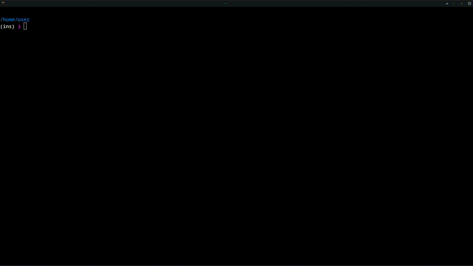

My Dotfiles
===========

Includes all kinds of installers and configurations.  
Currently only focused on **bash** on **Linux** (On a distro with *Apt* or *Pacman*)  



## Install.sh

Try it out with if you have curl installed. Worked and tested for Manjaro and Ubuntu.  

You can use the main file `install.sh` to run most of the necessary/interesting tweaks / get on overview of the most interesting tools added. If you have 'rlwrap' installed, it will give you a ton of easy 'yes/no' questions to go through. Keep pressing Ctrl+C if you want to quit out, or use Ctrl+Z in conjunction with 'ps' and 'kill -9 \<ProcessID-number\>' to kill the entire project.   
Again, if you cloned the github (or downloaded and unzipped it from github), just go into the folder and run the main file `install.sh`, **however** it's best to **source the file** if you want immediate effect (and if you want the greatest chance for the script to run without errors). This is because it includes **a lot of files with bashaliases and other essential scripts that need to be sourced** and **cannot be executed**.  

To do this, run:  

```
source ./install.sh
```
If you don't have the github cloned/downloaded, you could try to run this command (though experimental, not catastrophically) to get the same effect:  

```
eval "$(curl -fsSL https://raw.githubusercontent.com/excited-bore/dotfiles/main/install.sh)"
```

Creates `.environment.env` for global environment variables (Helps setting up variables for MAN,LESS,PAGER,EDITOR/VISUAL,SYSTEMD,XDG, etc..)  
Creates `~/.keybinds.d/` and `~/.keybinds.d/keybinds.bash` for Bash (readline) keybindings  
Creates `~/.bash_aliases` and `~/.bash_aliases.d/` for bash-aliases  
Creates `~/.bash_completion` and `~/.bash_completion.d/` for bash-completions  


Then it helps with installing/configuring:  
    - Bash-completions: https://github.com/cykerway/complete-alias/master/complete_alias  
    - Python-completions: https://github.com/kislyuk/argcomplete  
    - Osc clipboard: https://github.com/theimpostor/osc  
    - Bat (Cat clone): https://github.com/sharkdp/bat  
    - Fzf: https://github.com/junegunn/fzf  
    - Neofetch: https://github.com/dylanaraps/neofetch  
    - Bashtop: https://github.com/aristocratos/bashtop  
    - Autojump: https://github.com/wting/autojump  
    - Starship: https://starship.rs/  
    - Moar: https://github.com/walles/moar  
    - Ranger: https://github.com/ranger/ranger  
    - Neovim: https://neovim.io/  
&nbsp;&nbsp;- **Noteworthy plugins**:  
&nbsp;&nbsp;&nbsp;- Lazy.nvim adapter for vim-plug: https://gist.github.com/BlueDrink9/474b150c44d41b80934990c0acfb00be  
&nbsp;&nbsp;&nbsp;- Conquer of completion: https://github.com/neoclide/coc.nvim  
&nbsp;&nbsp;&nbsp;- NERDTree: https://github.com/preservim/nerdtree  
&nbsp;&nbsp;&nbsp;- NERDCommenter: https://github.com/preservim/nerdcommenter  
&nbsp;&nbsp;&nbsp;- Vim-oscyank: https://github.com/ojroques/vim-oscyank  
&nbsp;&nbsp;&nbsp;- Vim-tmux-kitty-navigator: https://github.com/excited-bore/vim-tmux-kitty-navigator  
&nbsp;&nbsp;&nbsp;- Suda: https://github.com/lambdalisue/suda.vim  
&nbsp;&nbsp;&nbsp;- Glow: https://github.com/ellisonleao/glow.nvim  
&nbsp;&nbsp;&nbsp;- Which-key: https://github.com/folke/which-key.nvim  
&nbsp;&nbsp;&nbsp;- Toggleterm.nvim: https://github.com/akinsho/toggleterm.nvim  
&nbsp;&nbsp;&nbsp;- Ranger.vim: https://github.com/francoiscabrol/ranger.vim  
&nbsp;&nbsp;&nbsp;- Lazygit.nvim: https://github.com/kdheepak/lazygit.nvim  
&nbsp;&nbsp;&nbsp;- Fzf.vim: https://github.com/junegunn/fzf.vim  
&nbsp;&nbsp;&nbsp;- Fzf-preview: https://github.com/junegunn/fzf-preview.vim  
&nbsp;&nbsp;&nbsp;- Vim-airline: https://github.com/vim-airline/vim-airline  
    - Nvimpager: https://github.com/lucc/nvimpager  
    - Tmux: https://github.com/tmux/tmux  
    - Kitty: https://sw.kovidgoyal.net/kitty/  
    - Lazygit: https://github.com/jesseduffield/lazygit  
    - Diff syntax highlighters:  
&nbsp;&nbsp;- Difftastic: https://difftastic.wilfred.me.uk/  
&nbsp;&nbsp;- Delta: https://github.com/delta-io/delta  
&nbsp;&nbsp;- Riff: https://github.com/walles/riff  
&nbsp;&nbsp;- Ydiff: https://github.com/ymattw/ydiff  
&nbsp;&nbsp;- Diff-so-fancy: https://github.com/so-fancy/diff-so-fancy  
&nbsp;&nbsp;- Diffr: https://github.com/mookid/diffr  


Also helps configuring global gitconfig and global gitignore, and gives the option to install all kinds of bash-aliases/.bash_aliases.d/functions


## Install_git.sh
Script to automate setting up pagers, syntax highlighters, lazygit and copy-to. Works remotely with

```
eval "$(curl -fsSL https://raw.githubusercontent.com/excited-bore/dotfiles/main/install.sh)"
```

## Install_gitignore.sh
Script to automate setting up local or global gitignore using templates from https://github.com/github/gitignore

## Install_go.sh
Script to automate installation of go, included for installation on distributions with less up-to-date go versions 

## Install_flatpak.sh
Installs flatpak with the added option to set flatpak-wrappers for commandline and install https://github.com/tchx84/Flatseal alongside

## Install_polkit_wheel.sh
Prevents password popups if user in wheel/sudo group

## Install_automount_usb.sh
Script to automate configuring automounting drives in /etc/fstab

## Install_samba.sh
Script to automate the installation of network drives using samba.

## Install_pipewire_switch_on_connect.sh
Setup to autoswitch to newest plugged in audiodevice.
